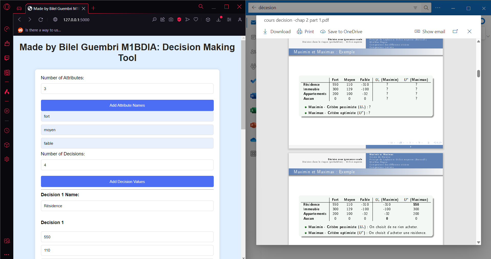
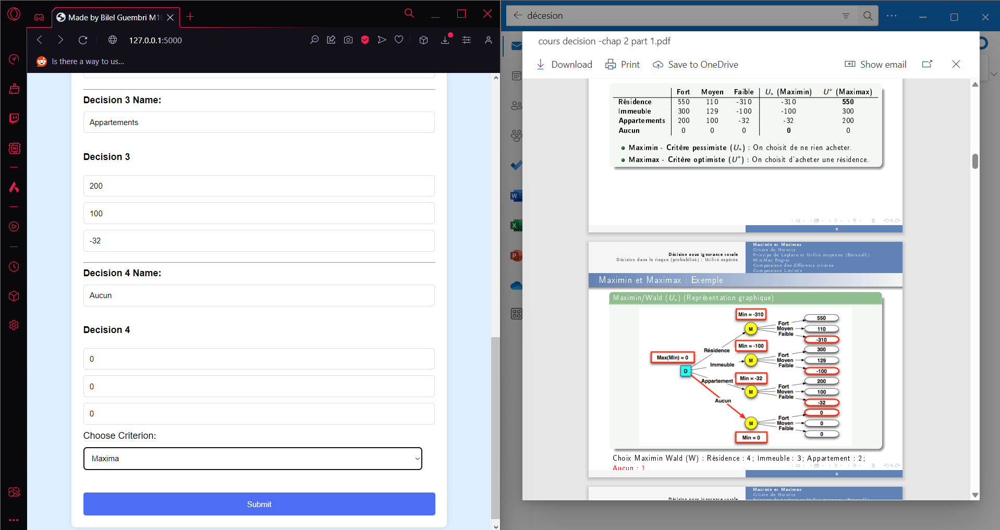

## Personal Portfolio

Welcome to my portfolio! Here, you will find an overview of my skills, projects, and professional journey. Discover my most remarkable achievements and explore enriching collaboration opportunities. This repository is specially dedicated to confidential and personal projects, offering detailed descriptions and screenshots for reference. Thank you for visiting!

## Features

- **Visual Presentation:** A sleek and modern design for an optimal user experience.
- **Projects:** Explore my past and current projects with detailed descriptions.
- **Skills:** A comprehensive list of my technical and professional skills.
- **Contact:** Get in touch with me through the provided contact information.

## Completed Projects

### Project 1 -> In-Depth Analysis of Patient Satisfaction in the Medical Context

As part of my Master's in Big Data and Artificial Intelligence, I conducted an In-Depth Analysis of Patient Satisfaction in the Medical Context using methods such as PCA, CA, MCA, and classification techniques like K-means. Through these advanced analytical methods, I explored overall responses to a questionnaire.

In conclusion, this study highlights the crucial importance of certain aspects, such as the professionalism of caregivers, empathetic communication, and medical competence, in shaping patient satisfaction. These insights provide valuable avenues for improving healthcare delivery and strengthening the patient-caregiver relationship.

**Keywords:**
Learning preferences, PCA, CA, MCA, Classification.

This report aims to deepen the understanding of the determinants of patient satisfaction with healthcare by exploring the complex relationships between various variables. Through in-depth analyses, we seek to uncover the key factors that positively or negatively influence the patient experience in the medical context.

.png)
.png)
.png)
.png)

## Project 2 -> 3rd Place Winners - Airbnb and 2024 Olympics Hackathon

Our team won the 3rd prize at a hackathon focused on Airbnb and the 2024 Olympics. The challenge for participating teams was to propose enhancements to the Airbnb user experience by incorporating geographic analysis, natural language processing (NLP), and host profile studies. Our approach included understanding travelers' preferences based on location, past habits, and activities they enjoyed in a specific area, proposing experiences tailored to users' interests while considering factors such as weather, sports events, and tourist activities developed around them.

Additionally, we suggested implementing a search function based on natural language processing (NLP) to allow users to find accommodations using more natural and conversational queries. We also analyzed listing descriptions and user reviews to understand the most important features and amenities for each traveler, thereby refining search results accordingly. We extracted the requirements requested by tenants and performed sentiment analysis to categorize them based on their needs.

.png)
.png)
.png)

## Project 3 -> Participation in a Hackathon: Human Resource Management System for Hospitals with Machine Learning Integration

Participation in a hackathon to develop a human resource management (HRM) system for hospitals, integrating machine learning models to monitor patient conditions and predict real-time probabilities of nosocomial infection risks.

**Skills:** Machine Learning · Laravel · Teamwork · Team Leadership

.png.jpg)
.jpg)
.jpg)
.jpg)
.jpg)
.jpg)

## Project 4 -> Top 5% in Kaggle Competition - House Price Prediction

Participated in a Kaggle competition to predict house prices in Ames, Iowa, using 79 explanatory variables. Ranked 471st, placing in the top 5% of competitors. Implemented data preprocessing techniques, including handling missing values and outliers, feature engineering, and used various advanced regression models. Additionally, applied stacking and blending techniques with models such as ElasticNet, Lasso, Ridge, SVR, GradientBoosting, XGBoost, and LightGBM for predictions.

.png)
.png)
.png)

## Project 5 -> Analysis and Model Selection for Prostate-Specific Antigen (PSA) Prediction

The objective of this project is to develop accurate and robust predictive models to estimate the level of prostate-specific antigen (PSA) from various clinical variables. PSA is a crucial biomarker for assessing the risk of prostate cancer. The data used comes from the study by Stamey et al. (1989) and includes variables such as the logarithm of cancer volume, the logarithm of prostate weight, age, and other relevant clinical characteristics.

The project begins with a data exploration phase, which includes visualizing distributions, checking for missing values, and normalizing variables to ensure data quality before modeling. Several techniques are then applied, including classical linear models, model selection methods, regularization techniques (Ridge, Lasso, Elastic Net), partial least squares regression (PLS), and principal component regression (PCR).

Each method is evaluated with different configurations to ensure model optimality. Cross-validation techniques are used to select the best hyperparameters and assess the predictive performance of each model. The goal is to compare these approaches to identify the most effective and applicable method in a clinical context for predicting PSA levels.

Skills: Machine Learning

.png)
.png)
.png)
.png)

## Project 6 -> Comparison of Algorithms for Solving the N-Queens Problem in Artificial Intelligence

This study compares various algorithms to solve the N-Queens problem, a classic problem in artificial intelligence. The N-Queens problem involves placing N queens on an N × N chessboard such that no queen threatens another, according to the rules of chess. The problem is formalized as a Constraint Satisfaction Problem (CSP).

Objectives:

- Formalize the N-Queens problem as a CSP.
- Implement and compare the AC3 algorithm, depth-first search with backtracking, and the forward-checking algorithm.
- Analyze the results and draw conclusions.

Skills: Artificial Intelligence (AI) · Algorithms

.png)
.png)
.png)
.png)
.png)

## Project 7 -> Q-Learning Algorithm Implementation for Maze Solving

This project, part of the Master's program in Big Data and Artificial Intelligence, focuses on implementing the Q-learning algorithm to solve maze problems. The objective is to train an agent to find the shortest path between a starting point and an exit point in a maze while avoiding walls. The project involves creating the maze structure, defining states, actions, rewards, and algorithm parameters, training the agent using Q-learning, and validating its ability to find optimal paths in various maze configurations.

Skills: Reinforcement Learning

.png)
.png)
.png)
.png)

## Project 8 -> Decision-Making Tool Under Uncertainty: A Python Flask Web Application

This project, developed during my university studies, involved creating a web application using Python Flask to aid in decision-making under uncertainty. The tool allows users to input decision criteria and weights for each criterion. It then calculates the decision outcome using methods such as maximin, maximax, Laplace, Bernoulli, Hurwicz, and minimax regret. This enables users to compare results and make informed decisions.

Skills: Decision-Making

## Project 9 -> Web Scraper and Product Recommendation

Participate in our web scraping project, which extracts product information from various e-commerce sites in Tunisia, such as Mytek, Tunisianet, and SBS Informatique. The extracted data is stored in a MySQL database, providing functionalities such as data extraction, database storage, visualization, filtering, and prediction.

.png)
.png)
.png)
.png)
.png)
.png)

## Project 10 -> Participation in the "HACKATHON INNOV'it V2.0" on March 4, 5, and 6, 2022 at ISAMM, presented by ISAMM's young engineers

We developed a solution for recycling primarily cotton clothing.

## Project 11 -> Online Learning Platform

Embark on a language learning journey with our eLearning platform powered by PHP. Similar to Udemy, it offers a dynamic and certified learning experience for language enthusiasts. Enjoy a responsive design, customizable learning paths, certified instructors, and a secure, feature-rich environment. Start your language journey today, master new skills, and earn recognized certifications.

- Personalized learning with adaptive training programs.
- Comprehensive skill assessment and progress tracking.
- Interaction with 3D models for immersive visualization of linguistic concepts.
- API integration using Django and Django REST for seamless interaction with the frontend.
- Intelligent chatbot powered by Flask, using natural language processing (NLP).
- Chatbot functionalities include word meaning clarification, answering user questions, and providing precise definitions.
- Security assessment with Nmap, Nikto, OWASP Zap, Burp Suite, DirBuster, and GoldenEye.

*Technologies:* Django, Python, Flask, React.js, Three.js, PostgreSQL.

*Feedback:*
Flight2Fluency, acclaimed with the highest rating of the 2023 class, features an advanced chatbot using Flask, NLP, and 3D model integration. Learners benefit from interactive language assistance, precise explanations of word meanings, and user-friendly responses to queries. The project's robust security assessment and tech stack, including Django, Python, React.js, Three.js, and PostgreSQL, received positive reviews for its overall excellence.

.png)
.png)

## Project 12 -> Website Manager and CRM

Discover our comprehensive project management and CRM platform, a PHP-based solution designed to simplify project management and customer relationship management processes. This all-in-one platform includes unified project management, sales and customer management, team collaboration, and customizable dashboards. With a user-friendly interface and scalability, it aims to enhance productivity and ensure a secure and reliable experience.

*Key Features:*
- Unified project management
- Sales management
- Customer management
- Team collaboration
- Customizable dashboards
- Reports and analytics
- User-friendly interface
- Scalable and flexible
- Secure and reliable

.png)
.png)

## Project 13 -> Online Learning Platform for Language Skills Improvement and Test Preparation

This platform offers personalized learning experiences with adaptive training programs and comprehensive skill assessments. It provides innovative tools for immersive visualization of linguistic concepts and progress tracking.

.png)
.png)
.png)
.png)
.png)

## Project 14 -> Versatile News and Magazine Script

Discover the versatility of our PHP-powered news and magazine script, offering a clean, responsive, and user-friendly design for creating and managing sophisticated websites. With features such as multilingual support, RTL support, SEO optimization, and various layout options, this script ensures a smooth experience for both administrators and visitors.

*Key Features:*
- Clean and responsive design
- Multilingual system
- RTL support
- SEO optimization
- Various layout options
- Author management system
- RSS aggregation system
- Advertisement spaces
- Progressive Web App (PWA) support
- AWS S3 integration
- Structured data
- Editable pages
- Contact page
- Playlist
- Featured articles, newsfeed, and emoji reactions
- Various publication formats
- Scheduled and pending publications
- Newsletter and subscriber management
- Dynamic image loading and tagging system
- Polls and social integration
- Widgets and page view counts
- Comment system
- Role and permission management
- Membership system
- Advanced settings and visual customization
- Security and authentication

.png)
.png)
.png)
.png)

## Personal Portfolio

This is my personal portfolio! I am Bilel, a dedicated freelancer with a Master's in Big Data and Artificial Intelligence from Université Paris Dauphine. I specialize in data science, machine learning, web development, and much more. My journey in the tech world is driven by a passion for creating innovative solutions that enhance learning and simplify processes.  
https://bilelguembri.netlify.app

.png)
.png)
.png)
.png)

Thank you for visiting the "My Projects" section of my portfolio! If you have any questions or want to explore a project in more detail, feel free to contact me. Your interest is greatly appreciated!